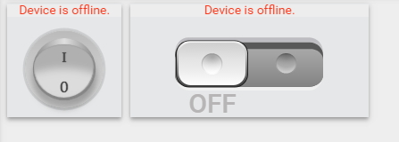
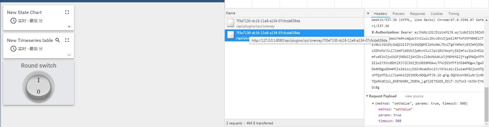

# MQTT协议设备控制

首先在设备中添加一个双向通信设备，如Device的开关控制设备。如图所示：



在点击控件进行设计时，通过页面分析。可以看到是通过/api/plugins/rpc/oneway进行调用。

具体接口实现代码在application\src\main\java\org\thingsboard\server\controller\rpccontroller.java中



```java
@PreAuthorize("hasAnyAuthority('SYS_ADMIN', 'TENANT_ADMIN', 'CUSTOMER_USER')")
@RequestMapping(value = "/oneway/{deviceId}", method = RequestMethod.POST)
@ResponseBody
public DeferredResult<ResponseEntity> handleOneWayDeviceRPCRequest(@PathVariable("deviceId") String deviceIdStr, @RequestBody String requestBody) throws ThingsboardException {
    return handleDeviceRPCRequest(true, new DeviceId(UUID.fromString(deviceIdStr)), requestBody);
}
```

从代码可以看出，限定了认证用户为SYS_ADMIN,TENANT_ADMIN,CUSTOMER_USER。接口调用方式为POST，数据传输主要为url后附带的deviceID和调用中的requestBody。

```java
private DeferredResult<ResponseEntity> handleDeviceRPCRequest(boolean oneWay, DeviceId deviceId, String requestBody) throws ThingsboardException {
    try {
        JsonNode rpcRequestBody = jsonMapper.readTree(requestBody);
        RpcRequest cmd = new RpcRequest(rpcRequestBody.get("method").asText(),
                jsonMapper.writeValueAsString(rpcRequestBody.get("params")));

        if (rpcRequestBody.has("timeout")) {
            cmd.setTimeout(rpcRequestBody.get("timeout").asLong());
        }
        SecurityUser currentUser = getCurrentUser();
        TenantId tenantId = currentUser.getTenantId();
        final DeferredResult<ResponseEntity> response = new DeferredResult<>();
        long timeout = System.currentTimeMillis() + (cmd.getTimeout() != null ? cmd.getTimeout() : DEFAULT_TIMEOUT);
        ToDeviceRpcRequestBody body = new ToDeviceRpcRequestBody(cmd.getMethodName(), cmd.getRequestData());
        accessValidator.validate(currentUser, deviceId, new HttpValidationCallback(response, new FutureCallback<DeferredResult<ResponseEntity>>() {
            @Override
            public void onSuccess(@Nullable DeferredResult<ResponseEntity> result) {
            }

            @Override
            public void onFailure(Throwable e) {

            }
        }));
        return response;
    } catch (IOException ioe) {
        throw new ThingsboardException("Invalid request body", ioe, ThingsboardErrorCode.BAD_REQUEST_PARAMS);
    }
}
```

其中调用handleDeviceRPCRequest，在twoway和oneway都调用handleDeviceRPCRequest进行处理。twoway和oneway在handleDeviceRPCRequest中处理相同，只是回传到异步回调中的rcpRequest中。在handleDeviceRPCRequest中前段主要处理客户端请求中的方法。在系统中处理的方法是method,timeout。方法解析完后异步处理认证问题。

用户认证成功后通过调用

```java
deviceRpcService.processRestAPIRpcRequestToRuleEngine(rpcRequest, fromDeviceRpcResponse -> reply(new LocalRequestMetaData(rpcRequest, currentUser, result), fromDeviceRpcResponse));
```

在processRestAPIRpcRequestToRuleEngine中首先将返回后回调数据入队。存入localToRuleEngineRpcRequests本地map中，使用requestId作为KEY。